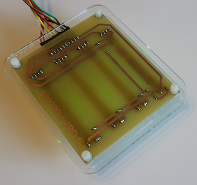

# **LabTools** : Analogue input slider panel

## What

This slider panel is part of a homemade toolset of modules to simplify the r&d phase of my µ-controller projects. It consists of four [linear slider potentiometers](pdf-files/Bourns slider potentiometer datasheet.pdf), which are connected as [voltage dividers](https://en.wikipedia.org/wiki/Voltage_divider). Built with the component values as stated in the bill-of-materials, the panel is optimized for 0 to 5V ADC's. Thanks to its universal layout, the module can easily be adapted for other voltage ranges, by changing the resistor values.

## Why

Whilst playing around with µ-controllers and their peripherals, I got often confronted with the need for analogue values for various reasons.
 - When designing a [ternary clock](https://github.com/nostradomus/Base3-clock) I had a need to mix my own cool colors to display with the RGB LED's in this project. The slider panel was just what I needed, as I could easily simulate the three color channels red, green and blue, plus the brightness on the fourth slider.
 - Next on a rainy Sunday, we decided to have some fun, and build our version of the [cool O++O robot](https://github.com/OttoDIY/OttoDIY). This cute little guy is running, or rather, dancing on four servos. In a project with *constrainted* movements, it is interesting to test the mechanical limits of your rotations before breaking any of your nice 3D-printed parts. YAGA ! **Yet another good application** for the slider panel.
 - When working with servos, not only the angular limits are important, but for several applications also the center point of the circular movement. This came in handy for a robot arm project based on radial coordinates.  
 - A completely different, but obvious example, was application testing. For practical reasons, most of the time, it is preferable to replace physical sensors by **controlled** test values. In pure programming these usually originate from test units. With this type of methodology however, it is utmost impossible to do exhaustive testing. Especially when combining multiple analogue values. For that matter, as an extra test, the slider panel has proven to be very handy.  
 - And their will probably be dozens of other useful applications for this little lab tool...

## How

Simple projects don't need complicated specifications. However once you start, there's always a couple of nice-to-haves you just have to go for.
 - The [slider potentiometers](pdf-files/Bourns slider potentiometer datasheet.pdf) should  
    - have a reasonable travel length for precision
    - have a linear taper
    - have a center detent
    - exist in different resistance values (10kΩ and higher)
    - have a built-in indicator LED
 - The [housing](#mechanical-construction) should have
    - an ID for each slider
    - labels for each pin on the interface connector
 - And the whole must be **fancy** :sunglasses:

## Progress status

 - [x] having a [need](#why)
 - [x] define the [functional specifications](#how)
 - [x] design the final [electronics](#electronics)
 - [x] build a proof-of-concept for the final [electronics](#electronics)
 - [x] write [code for the µ-controller](#µ-controller-code) respecting best-practices
 - [x] design and build a [state-of-the-art housing](#mechanical-construction)
 - [ ] write an end-user manual

## Technical details

### The voltage divider, the ADC and the mapping function

`...on the way, be patient...`

### Electronics

#### The PCB

`...on the way, be patient...`

#### Connection with a µ-controller board

`...on the way, be patient...`

### µ-Controller code

The demo/test software has been written in the free [Arduino IDE](https://www.arduino.cc/en/Main/Software), or as [sourcecode](https://github.com/arduino/Arduino/). No specific (or non-standard) libraries are required for this project.

`...on the way, be patient...`

#### Application example 1 : Robot-arm servo calibration

`...on the way, be patient...`

#### Application example 2 : RGB LED color calibration

`...on the way, be patient...`

### Mechanical construction

The housing consists of two layers of lasercut and engraved plexi plates. I would suggest to use 3mm of thickness. When using another thickness, pay attention to adapt the length of screws and bolts.

`...on the way, be patient...`

## Contributors

If you are having any good suggestions, just drop me a line [:email:](http://nostradomus.ddns.net/contactform.html).
If feasible, I'll be happy to implement proposed improvements.
And if you are having lots of time, I'll be happy to share the work with you ;-).

When you create your own version, don't forget to send us some nice pictures of your construction. We'll be happy to publish them in the :confetti_ball:Hall of Fame:confetti_ball:.

## :globe_with_meridians: License

There is no specific license attached to this project for personal use.

If you like it, have fun with it (at your own risk of course :-D), and especially, be creative.

Oh, and when using anything from this repository, it is highly appreciated if you mention its origin.

If you would like to use any of my work (or the whole project) for commercial use, just [contact me :email:](http://nostradomus.ddns.net/contactform.html), so we can add the appropriate license, which best fits your business.
